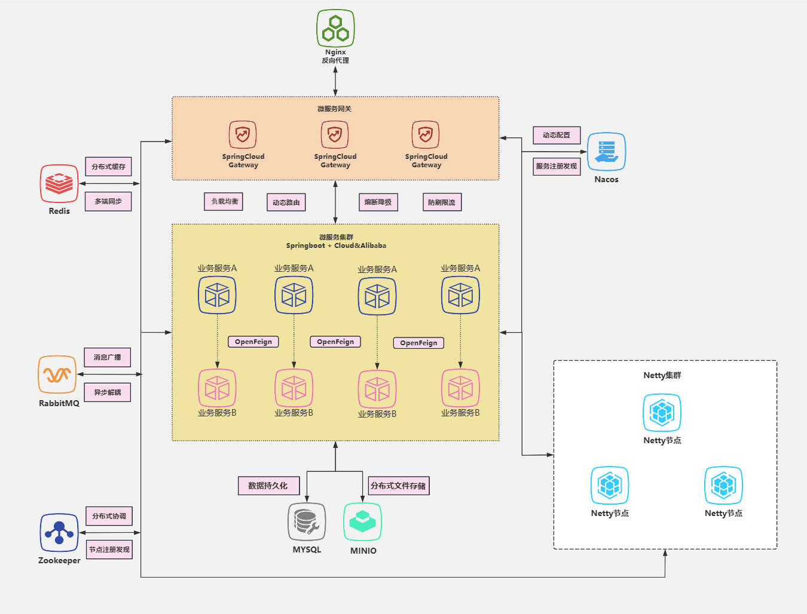

# AkiChat - 高性能分布式即时通讯系统

## 项目简介
AkiChat是一款企业级高性能即时通讯系统，基于微服务架构和分布式技术，提供稳定、高效的通讯服务。

    
    
    
    

## 🚀 核心特性
- **分布式架构**：基于**Zookeeper**实现的Netty分布式集群
- **高性能消息传输**：**Netty** + **RabbitMQ**实现高并发消息处理
- **多端支持**：UniApp开发的跨平台移动应用，目前已支持**H5|APP**双端
- **丰富功能**：
  - 单聊/群聊(多端同步)
  - 流媒体聊天
  - 通讯录管理
  - 友链系统
  - 个人信息
  - 漂流瓶

  

## 🏆 性能指标
### 本地Jmeter多次调试压测结果如下：
- **并发压测**: **64000**并行连接(约为单机测试机TCP端口上限)
- **吞吐量**: 发送端 **1000消息/秒** 接受端 **940消息/秒**
- **端到端延迟**: 平均**70ms**，最低**1ms**，最高**1700ms**
- **异常率**: 接近**0%**，平均不高于**0.5％**
### **具体数据请审阅本从仓库的csv测试结果集**

  
  

## 📦 快速开始

### 下载(APP端体验更完整)
- **App-蒲公英下载**: [应用下载地址](https://www.pgyer.com/jTfsVbdh)
- **App-Release下载**: [Release版本](https://github.com/aki-zone/Akichat/releases)

### 在线体验
- **H5版**: [在线地址](http://103.112.96.237:8082/)

## 📄 许可证
Akichat源码公开后在 Apache License 2.0 许可下可用。查看[LICENSE](LICENSE.txt)文件了解更多信息。

## 📞 联系方式
- [个人主页](https://github.com/aki-zone)

## 🌟 鸣谢
感谢所有相关公开文献及支持该项目的用户成员！
